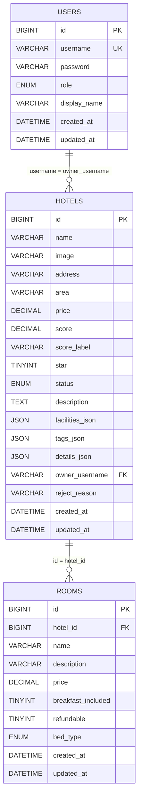

# 易宿酒店预订平台数据库文档

本文档基于当前项目真实实现整理：

- 运行态数据源：`hotel-server/data/db.json`
- 后端模型逻辑：`hotel-server/index.js`
- SQL 预案：`hotel-server/sql/init.sql`

---

## 1. 数据架构概览

当前项目采用 **JSON 文件持久化**（开发/训练营友好）：

```json
{
  "users": [],
  "hotels": [],
  "nextHotelId": 1,
  "nextRoomId": 1000
}
```

其中：

- `users`：账号信息（管理员、商户）
- `hotels`：酒店主数据（包含房型、设施、标签等）
- `nextHotelId`：酒店自增 ID 计数器
- `nextRoomId`：房型自增 ID 计数器

---

## 2. JSON 数据模型（当前生产实际）

## 2.1 users

| 字段 | 类型 | 必填 | 说明 |
|---|---|---|---|
| username | string | 是 | 用户名，建议唯一 |
| password | string | 是 | 密码（当前为明文，后续建议加密） |
| role | string | 是 | `admin` 或 `merchant` |
| name | string | 是 | 显示名称 |
| accessKey | string | 是 | AK，用于接口请求头鉴权 |
| secretKey | string | 是 | SK，用于签名计算（服务端校验） |
| secrectKey | string | 否 | 兼容字段（同 secretKey） |

示例：

```json
{
  "username": "merchant",
  "password": "123",
  "role": "merchant",
  "name": "希尔顿酒店集团",
  "accessKey": "ak_merchant_xxx",
  "secretKey": "sk_merchant_xxx",
  "secrectKey": "sk_merchant_xxx"
}
```

## 2.2 hotels

| 字段 | 类型 | 必填 | 说明 |
|---|---|---|---|
| id | number | 是 | 酒店主键 ID |
| name | string | 是 | 酒店名称 |
| englishName | string | 否 | 英文名称 |
| image | string | 是 | 主图 URL / Base64 |
| images | string[] | 是 | 图片列表（至少 1 张） |
| address | string | 是 | 地址 |
| area | string | 否 | 区域 |
| price | number | 是 | 基础价格 |
| score | number | 否 | 评分 |
| scoreLabel | string | 否 | 评分文案（如“超棒/新开业”） |
| star | number | 否 | 星级，默认 3 |
| status | string | 是 | `pending/approved/rejected/offline` |
| description | string | 否 | 酒店描述 |
| tags | string[] | 否 | 标签 |
| details | object[] | 否 | 详情键值数组（`{label,value}`） |
| facilities | string[] | 否 | 设施列表 |
| owner | string | 是 | 商户用户名（关联 users.username） |
| rooms | object[] | 否 | 房型列表 |
| rejectReason | string | 否 | 驳回原因（仅 rejected） |
| createdAt | string | 是 | ISO 时间 |
| updatedAt | string | 是 | ISO 时间 |

`rooms` 子对象：

| 字段 | 类型 | 必填 | 说明 |
|---|---|---|---|
| id | number | 否 | 房型 ID（旧数据可能缺失） |
| name | string | 是 | 房型名 |
| description | string | 否 | 房型描述 |
| price | number | 是 | 房型价格 |

示例（节选）：

```json
{
  "id": 1,
  "name": "上海陆家嘴禧玥酒店",
  "status": "approved",
  "owner": "merchant",
  "rooms": [
    {
      "id": 101,
      "name": "经典双床房",
      "price": 936
    }
  ]
}
```

---

## 3. 数据约束与默认值（来自后端逻辑）

在后端启动与写入时，会执行标准化逻辑（`ensureHotelDefaults`）：

- 若 `images` 缺失，则从 `image` 补齐；若 `image` 缺失则取 `images[0]`
- 若 `image` 与 `images` 都缺失，使用默认图片 URL
- `tags`、`facilities` 缺失时补空数组
- `details` 缺失时补默认 3 项：装修/风格/服务
- `rooms` 缺失时自动生成两种默认房型，并消耗 `nextRoomId`
- `scoreLabel` 缺失时按 `score` 自动推导（`超棒` 或 `新开业`）

酒店状态合法值：

- `pending`：待审核
- `approved`：已发布
- `rejected`：已拒绝
- `offline`：已下线

---

## 4. 关系模型（逻辑层）

- `users.username (1) -> (N) hotels.owner`
- `hotels.id (1) -> (N) rooms[*]`（当前 rooms 内嵌在 hotels）

备注：当前 `rooms` 是内嵌结构，不是独立集合，因此跨酒店统计房型时需要遍历酒店数组。

### 4.1 鉴权静态模型（JSON 运行态）

- `users.accessKey (1) -> (1) users.secretKey`
- 受保护接口使用如下规则进行校验：
  - `sign = SHA256(body + '.' + secretKey)`
  - `accessKey` 定位用户
  - `nonce` 范围校验（0~100000）
  - `timestamp` 时效校验（5 分钟）

说明：

- `secretKey` / `secrectKey` 同值并存，用于兼容历史字段拼写
- 当前仅管理端敏感接口要求签名，公开接口可匿名访问

### 4.2 数据库静态模型（ER）

> 以下为基于 `hotel-server/sql/init.sql` 的静态模型（MySQL 预案）：



关系说明：

- 一个用户（商户）可拥有多家酒店（`USERS 1:N HOTELS`）
- 一家酒店可包含多个房型（`HOTELS 1:N ROOMS`）
- `rooms` 设有 `ON DELETE CASCADE`，删除酒店时会级联删除对应房型

---

## 5. SQL 预案（MySQL）

项目已提供 MySQL 初始化脚本：`hotel-server/sql/init.sql`，核心表如下：

- `users`
- `hotels`
- `rooms`

关键设计：

- `users.username` 唯一
- `hotels.owner_username` 外键指向 `users(username)`
- `rooms.hotel_id` 外键指向 `hotels(id)`，并 `ON DELETE CASCADE`
- 数组字段在 SQL 中使用 JSON 列：
  - `hotels.facilities_json`
  - `hotels.tags_json`
  - `hotels.details_json`

### 5.1 JSON -> MySQL 字段映射建议

| JSON 字段 | MySQL 列 |
|---|---|
| users.username | users.username |
| users.password | users.password |
| users.role | users.role |
| users.name | users.display_name |
| users.accessKey | users.access_key *(建议新增)* |
| users.secretKey | users.secret_key *(建议新增)* |
| hotels.id | hotels.id |
| hotels.name | hotels.name |
| hotels.image | hotels.image |
| hotels.address | hotels.address |
| hotels.area | hotels.area |
| hotels.price | hotels.price |
| hotels.score | hotels.score |
| hotels.scoreLabel | hotels.score_label |
| hotels.star | hotels.star |
| hotels.status | hotels.status |
| hotels.description | hotels.description |
| hotels.owner | hotels.owner_username |
| hotels.rejectReason | hotels.reject_reason |
| hotels.tags | hotels.tags_json |
| hotels.facilities | hotels.facilities_json |
| hotels.details | hotels.details_json |
| hotels.createdAt | hotels.created_at |
| hotels.updatedAt | hotels.updated_at |
| hotels.rooms[*] | rooms 表（按 hotel_id 拆分） |

---

## 6. 索引建议（MySQL 化时）

建议至少增加以下索引：

- `users(username)`（唯一，已在脚本）
- `users(access_key)`（唯一，建议新增）
- `hotels(status)`
- `hotels(owner_username)`
- `hotels(updated_at)`
- `hotels(area)`（可选，按筛选需求）
- `rooms(hotel_id)`（外键通常会带索引）

---

## 7. 数据安全与运维建议

当前 JSON 方案下：

- 建议每日备份 `hotel-server/data/db.json`
- 发布前先备份，再重启 PM2
- 建议把密码改为哈希存储（如 bcrypt）
- Base64 图片体积大，建议后续迁移到对象存储（COS）并仅保存 URL

---

## 8. 版本说明

- 文档版本：v1.1
- 适配后端版本：当前 `hotel-server/index.js`（2026-02-24）
